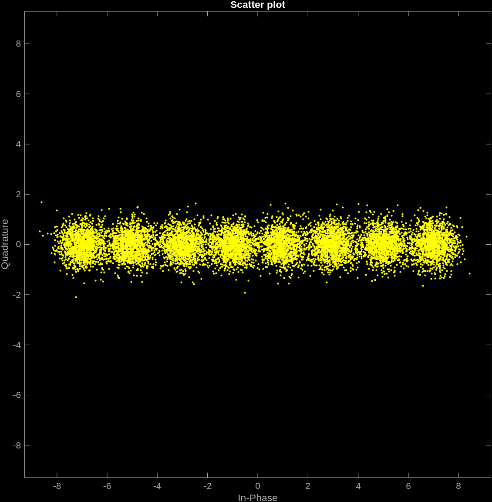
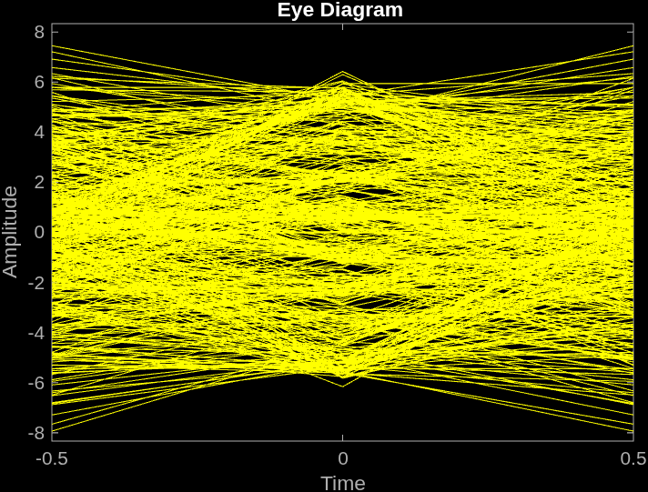
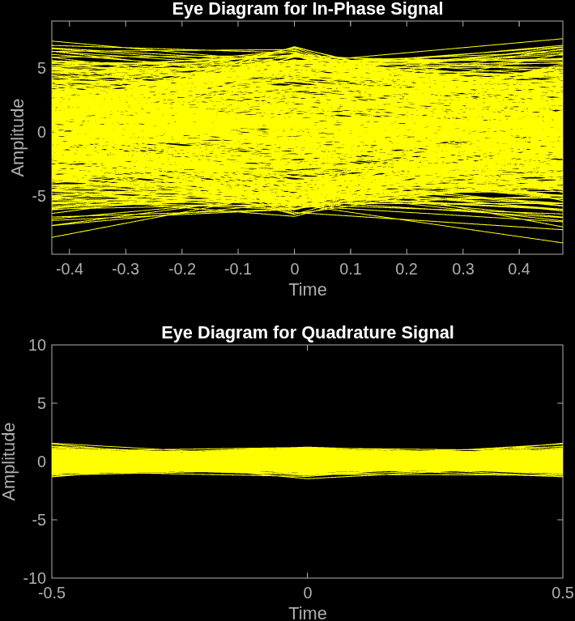
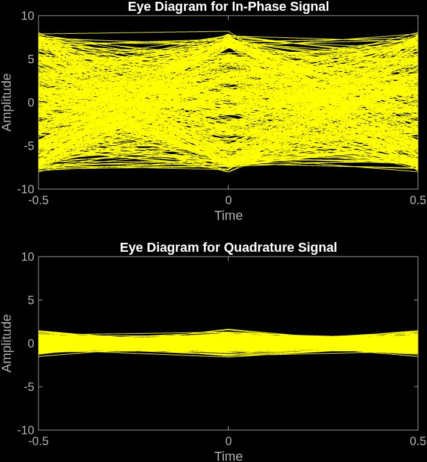

# PAM-transceiver-simulation
  A MATLAB Simulation of Pulse Amplitude Modulation (PAM) complete digital communication system. Includes simulated transmission and reception chain. The project demonstrates the entire PAM system with pulse shaping, simulated additive white Gaussian noise (AWGN) and is recovered using a matched filter and decision block.

## Features
  - **Configurable Modulation Order** — Supports any power-of-two PAM order (2-PAM, 4-PAM, 8-PAM, 16-PAM, 32-PAM, ...),  with no technical fixed modulation-order limit in the simulation.
  - **Configurable SNR** — Simulated Channel features configurable Eb/N0 (dB) to change SNR where 
  $$
  \mathrm{SNR}_{\mathrm{dB}} =
  \frac{E_b}{N_0}
  \frac{\log_2(M)}{\mathrm{sps}}
  $$

  - **Generates Figures and BER data** — Generates Constellation of Received Signals and Eye Diagrams for Transmitted Signal, Noisy Signal, and Received Signal.

## Figures
  **Variables used for example figures:**
  - Modulation Order = 8
  - 3e4 bits
  - Eb/N0 (dB) = 12
    

